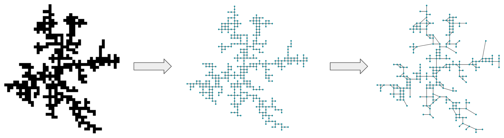

# Generating urban-like networks with DLA



## Getting started

To install all necessary packages, run:
```
  pip3 install requirements.txt
```

## Modules
- `dla_model_final.py` - functions for generating DLA arrays (including dynamic stickiness) and calculating fractal dimension
- `networks.py` - functions for generating networks from DLA, retrieving real-life networks, converting city networks into fractals and performing analysis
- `animate_grid.py` - function for generating animated gifs from DLA numpy arrays
- `fractal_city.py` - code for retrieving fractals from real-life city networks

### Other

- `experiments.py` - code used for running experiments with changing stickiness and number of walkers; and saving the results into .npy files
- `result_analysis.py` - code used for reading .npy DLA arrays and extracting network statistics from them

## Usage examples

Notebook with usage examples of the code can be found in `examples.ipynb` 
